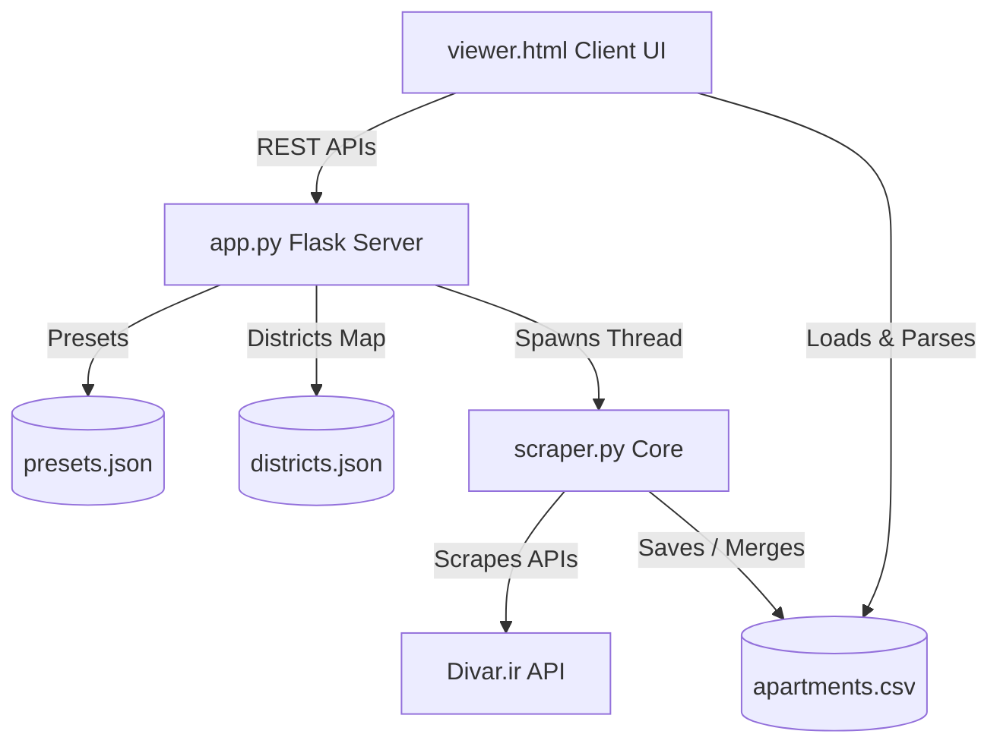

# 🏢 Divar Real Estate Scraper & Web Analytics Hub

A premium, modern web dashboard and background scraper for searching, tracking, and analyzing real estate listings on **Divar.ir** (specifically tailored for Tehran apartments, but customizable for other cities and categories).

This repository features a robust background crawler that fetches apartment details, parses key attributes, supports deep custom filters, handles incremental scraping, and compiles structured databases inside CSV files. A slick, dark-themed, glassmorphic analytics hub lets you manage scrapes, explore listings, apply rich filters, and export results seamlessly.

---

## ✨ Key Features

- **🌐 Live Scraping Dashboard**: An interactive, premium web console (`viewer.html`) with real-time logs, progress bars, and statistical indicators.
- **🔄 Incremental Scraping**: Detects previously scraped listing tokens and automatically skips them to conserve bandwidth and API rate limits.
- **🔍 Deep Filtering System**:
  - Location (granular district selections mapped from `districts.json`)
  - Size / Area ($m^2$)
  - Total Price (in Billion Tomans)
  - Price per $m^2$ (in Million Tomans)
  - Age of building (automatic calculation based on Shamsi/Gregorian calendar years)
  - Amenities (Elevator, Parking, Storage)
  - Bedrooms (0, 1, 2, 3, 4+)
  - Listing photo verification ("Authentic Photos" / *همین ملک*)
- **💼 Preset Management**: Save, load, and delete filter configurations to reproduce popular searches instantly.
- **📊 Real-time Data Table**:
  - Interactive grid displaying all listing columns
  - Direct links back to the original listing on `divar.ir/v/<token>`
  - Client-side sorting, searching, and filtering on scraped CSVs (powered by `PapaParse`)
  - Status badges and highlight modes (e.g. green borders for properties meeting elevator criteria)
- **⚡ Smart CLI Utility**: Run headless background scraping directly from the command line when a UI is not needed.

---

## 🛠️ Codebase Architecture

The project is structured logically around a Flask backend server, a Python scraper, and a client-side single-page dashboard:



* **`app.py`**: The Flask backend server (`http://localhost:5000`). Exposes REST API endpoints to load/save presets, list and retrieve output CSV files, spin up background scraping threads, and report live progress/logs.
* **`scraper.py`**: The core scraper engine. Connects to Divar's search APIs, politely fetches detailed specifications for individual properties with randomized delays to bypass IP blocks, cleans up Persian/Arabic digits, and outputs structured CSV records.
* **`viewer.html`**: A highly stylized, fully responsive dashboard frontend utilizing HSL variables, fluid gradients, stats containers, filter forms, and a terminal log console.
* **`districts.json`**: Mapping table containing Persian district names and their corresponding internal Divar category/district IDs.
* **`presets.json`**: Local registry storing saved custom filter profiles.
* **`probe.py`**: A helper script to test/fetch raw API schemas for specific Divar property tokens.

---

## 🚀 Setup & Installation

### Prerequisites
- Python 3.8 or higher installed on your machine.
- Pip (Python Package Manager).

### 1. Initialize Virtual Environment (Optional but Recommended)
In your terminal, navigate to the project directory and create a virtual environment:

```bash
# Create a virtual environment named 'venv'
python -m venv venv

# Activate on Windows:
venv\Scripts\activate

# Activate on macOS/Linux:
source venv/bin/activate
```

### 2. Install Required Dependencies
Install the required Python packages:

```bash
pip install Flask requests pandas
```

*Note: `pandas` is used to load, clean, deduplicate, and write scraped entries seamlessly. The scraper contains a standard `csv` module fallback if `pandas` is not available.*

---

## 💻 Running the Application

There are two main ways to use this tool: via the **Interactive Web Dashboard** or as a **Command-Line Tool**.

### Option A: The Interactive Web Dashboard (Recommended)

1. Start the Flask server:
   ```bash
   python app.py
   ```
2. Open your web browser and navigate to:
   ```text
   http://localhost:5000
   ```
3. Use the **Scraper** tab to configure your filters (e.g., target districts, price ranges, minimum amenities), name your output CSV, and hit **Launch Scraper**.
4. Monitor the live terminal log, page-by-page progress, and match counters in real time.
5. Once completed, switch to the **Viewer / Analytics** tab to explore, sort, search, and inspect the properties inside your CSV!

---

### Option B: The Headless CLI Scraper

If you prefer running a quick scrape in the background without opening a browser:

```bash
# Run the scraper with default filter configurations for 10 pages
python scraper.py 10
```

To modify filter values in CLI mode, you can edit the default search dict defined in the `main()` function at the bottom of [scraper.py](file:///c:/Users/Pi/Documents/0CodeBase/divar-git/scraper.py):
```python
filters = {
    "city_ids": ["1"],          # "1" represents Tehran
    "category": "apartment-sell",
    "area_min": 40,
    "area_max": 140,
    "price_m2_min": 175.0,     # Price per m2 min (Million Tomans)
    "price_m2_max": 325.0,     # Price per m2 max (Million Tomans)
    "elevator": "Yes",
    "parking": "Any",
    "storage": "Any",
    "max_pages": max_pages,
    "output_file": "apartments.csv"
}
```

---

## 📊 Scraped Data Schema

Each row in the compiled CSV includes the following detailed parameters:

| Column Name | Type | Description |
| :--- | :--- | :--- |
| `token` | String | Divar's unique listing identifier |
| `title` | String | Title of the property listing (Persian) |
| `district` | String | Persian name of the district (e.g., *سعادت‌آباد*) |
| `city` | String | City name (e.g., *تهران*) |
| `category` | String | Listing category (e.g., `apartment-sell`) |
| `area_m2` | Integer | Property surface area in square meters |
| `rooms` | Integer | Number of bedrooms |
| `floor` | String | Floor number (e.g., `2` or `0` for ground floor) |
| `total_floors` | String | Total floors in the building |
| `age` | Integer | Building age (Calculated dynamically using current Shamsi/Gregorian offsets) |
| `total_price_tomans`| Integer | Raw total price in Iranian Tomans |
| `total_price_mtomans`| Float | Total price in Million Tomans |
| `price_per_m2_mtomans`| Float | Price per square meter in Million Tomans |
| `elevator` | String | Elevator availability (`Yes` / `No`) |
| `parking` | String | Parking availability (`Yes` / `No`) |
| `storage` | String | Storage unit availability (`Yes` / `No`) |
| `authentic_photos` | String | Verified listing photos indicator (`Yes` / `No` / `N/A`) |
| `post_date` | String | Internal unix-timestamp representation of listing date |
| `url` | String | Clickable browser hyperlink directly to the listing page |

---

## 🔒 Polite Scraping & Safety Guidelines

1. **IP Bans & Rate Limits**: `scraper.py` is configured with a polite scraping layout that implements randomized sleep durations (`0.6s - 1.2s`) between individual listing fetches to respect Divar's servers. Avoid setting `max_pages` excessively high (e.g., > 100) in rapid succession to prevent temporary IP soft blocks.
2. **Incremental Logic**: By utilizing the **Incremental Scraping** feature, you can run crawls frequently. Since the scraper checks for pre-existing listings in your target CSV and only pulls details for *new* listings, this heavily reduces network usage and server requests.
3. **Data Storage**: Avoid editing the generated CSVs directly inside excel while a scrape is in progress, as it locks the file and may interrupt the final write phase.

---

## 🎨 Design Aesthetics & Tech Stack

- **Backend**: Python 3, Flask, `requests`, `pandas`
- **Frontend**: Clean Semantic HTML5, Vanilla ES6 Javascript (Asynchronous Fetch APIs, `PapaParse` for CSV handling)
- **CSS**: Custom-crafted HSL Dark System, featuring radial glow backdrops, frosted-glass components, hover-triggered transitions, and responsive grid alignment.
- **Aesthetics**: Outfit & Vazirmatn fonts, glowing accent borders, a live terminal output mockup, and real-time status reporting.
